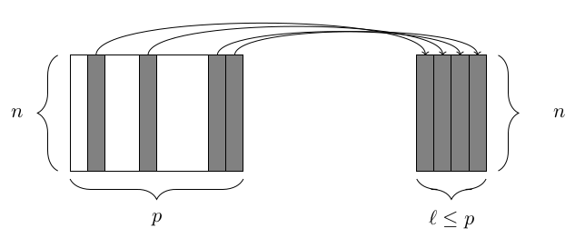
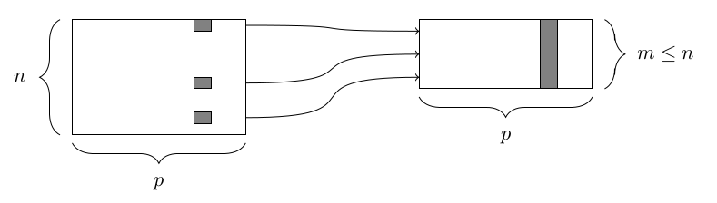
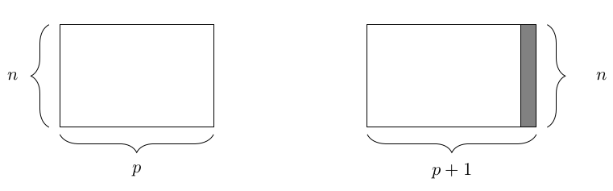
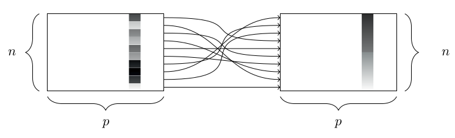

```{r setup, include=FALSE,eval=FALSE}
knitr::opts_chunk$set(echo = TRUE)
```

## Опис загального процесу машинного навчання

Загальний цикл процесу виглядає так:

1. Формулювання питання і його уточнення.
2. Збір і очистка даних.
3. Попереднє дослідження даних.
4. Побудова моделі
5. Навчання моделі
6. Інтерпретація і оцінка результатів
7. Повернення до п.1.


## Основні етапи. Збір даних.

Збір даних є критично важливим для усього процесу. Без якісних, очищених даних будь-які алгоритми не мають ніякої цінності. Тому для цього етапу слід відводити досить багато часу і чітко описати структуру наявних даних, їх джерела, якість і чистоту. 

## Основні етапи. Дослідження

Попереднє дослідження даних створює підгрунтя для наступної аналітики. Перший етап полягає у детальному дослідженні можливих областей значень, прихованих залежностей, помилок і пропущених даних, статистичних характеристик і т.д.  

## Основні етапи. Побудова моделі

Яу вважають автори книги "Machine Learning Using R" більшість проектів з машинного навчання зупиняється на 1-2 фазі. Однак, якщо вони дійшли до етапу 3, у них є хороший шанс дійти до продукту. На цьому етапу відбувається дослідження можливих алгоритмів МН та обгрунтування доцільності їх використання. 

В нормальній бізнес-моделі для отримання схвалення на використання методів МН потрібно обчислення РОІ, час, гроші і т.д.

Іноді використання МН є надмірним, достатно простої описової статистичної моделі. 

## Основні етапи. Валідація

Цей етап визначає наскільки все вийшло і чи не час все викинути і почати спочатку? Іноді такі кола трапляються, оскільки складність процесів і даних обумовлює складність вирішення. А МН є такою "чарівною паличкою", використання якої говорить, що ви не розумієте дані або проблему. Дуже малоймовірним є побудова моделі МН з першої ітерації.

## Типи питань

1. Описові. Описують певну характеристику даних. Відсоток чоловіків у ВР.
2. Дослідницькі. Шукають тренди, приховані залежності і шаблони. Кількість чоловіків у ВР зменшується чи ні? Генеруються і потім перевіряються гіпотези. 
3. Inferential. Переформульовують гіпотезу у вигляді питання, відповісти на яке можливо лише з залученням додаткових даних. В Україні кількість чоловіків на керівних посадах (у владі) зростає чи ні?
4. Прогнозні. Задають модель передбачення. 
5. Каузальні. Чи щось залежить від чогось.

## Вернемось до депутатів

План дослідження:

1. Питання можуть бути різні
  1.1. Чи змінилось щось у віковому, майновому, освітньому і т.д. вимірах за ці майже 30 років?
  1.2. Скільки Саш і Вов буде в наступному скликанні?
  1.3. Чи є паттерни голосувань і як вони змінювались (які політичні події впливали)?
  1.4. Чи можна виділити кластери депутатів на основі їх поведінки (голосувань)?

Питання має бути не очевидне. 

## Отримання даних. Пряме звернення до csv

Перший варіант:

```{r, echo = TRUE}
data <- read.csv() .csv('https://data.rada.gov.ua/ogd/mps/skl1/mps01-data.csv')
```

Другий варіант:

```{r}
library (RCurl)
download <- getURL("https://data.rada.gov.ua/ogd/mps/skl1/mps01-data.csv")
data2 <- read.csv (text = download)
```

## Отримання даних. Пряме звернення до JSON

```{r}
library(jsonlite)
json_file <- "https://data.rada.gov.ua/ogd/mps/skl1/mps01-data.json"
data3 <- fromJSON(json_file)
```

## Функція str()

Дуже корисна функція для швидкого аналізу структури даних

```{r}
class(data)
str(data)
```

## Функція table()

Знаходить дублікати, обчислює кількість входжень. Можна знайти відсоток або долю.

```{r}
head(sort(table(data$first_name),decreasing = T),3)
```

## Питання: Як змінювались найпоширеніші імена серед депутатів?

Зчитаємо інформацію про всіх депутатів всіх скликань. 

```{r}
data_1 <- read.csv('https://data.rada.gov.ua/ogd/mps/skl1/mps01-data.csv')
data_2 <- read.csv('https://data.rada.gov.ua/ogd/mps/skl2/mps02-data.csv')
data_3 <- read.csv('https://data.rada.gov.ua/ogd/mps/skl3/mps03-data.csv')
data_4 <- read.csv('https://data.rada.gov.ua/ogd/mps/skl4/mps04-data.csv')
data_5 <- read.csv('https://data.rada.gov.ua/ogd/mps/skl5/mps05-data.csv')
data_6 <- read.csv('https://data.rada.gov.ua/ogd/mps/skl6/mps06-data.csv')
data_7 <- read.csv('https://data.rada.gov.ua/ogd/mps/skl7/mps07-data.csv')
data_8 <- read.csv('https://data.rada.gov.ua/ogd/mps/skl8/mps08-data.csv')
data_9 <- read.csv('https://data.rada.gov.ua/ogd/mps/skl9/mps09-data.csv')

```

## Завдання. 

1. Знайти найпопулярніше ім'я за всю історію.
2. Вивести 5 найпопулярніших імен для кожного скликання.

## Відповідь

1. Знайти найпопулярніше ім'я за всю історію.

```{r}
c.factor <- function(..., recursive=TRUE) unlist(list(...), recursive=recursive)
vec <- c.factor(data_1$first_name, data_2$first_name, data_3$first_name, data_4$first_name, data_5$first_name,
         data_6$first_name, data_7$first_name, data_8$first_name, data_9$first_name)
head(sort(table(vec),decreasing = T),10)
```

## Перетворення часу і дати

Дати описуються класом та перетворюються з символьного типу за допомогою функції as.Date().
```{r}
as.Date(data_1$birthday, format="%d.%m.%Y")
```

## Час

Час визначається стандартними форматами

```{r}
x <- Sys.time()
x
class(x)
## 'POSIXct' object
```

## Віднімання дат.

Питання: як обчислити середній вік депутатів? 
Задача: створити датафрейм з колонками: скликання, повне ім'я, стать, д.н., освіта.
Як працювати з датафреймами?

## Датафрейми

Головний тип даних. Приклад.

```{r}
L3 <-LETTERS[1:3]
fac <-sample(L3, 10, replace =TRUE)
df <-data.frame(x =1, y =1:10, fac = fac)
attributes(df)
```

## Датафрейми. Звернення до елементів.

```{r,eval=FALSE}
df[3,3]
df[1:2,2]
df[1,1:3]
df[,c(1,3)]
df[,c("x","y")]
```

## Звернення до векторів датафрейму

```{r,eval=FALSE}
df$x
df$x[1]
```
Додавання нових елементів до датафрейму

1. cbind, rbind
2. новий стовпець можна записати

```{r,eval=FALSE}
df$new <- c(10:1)
```

## Створимо менший датафрейм. 

Проблема 1. Кількість стовпців різна і різних датафреймах з даними про депутатів.
Проблема 2. Скільки дат народження невірного формату?

```{r}
df1 <- data_9[,c("convocation","full_name","first_name","gender","birthday","education","academic")]
```


## Векторизовані функції

* lapply : обчислює функцію для кожного елементу списку
* sapply : спрощений варіант lapply
* apply : обчислє функцію на основі масиву 
• tapply : обчислює функцію для підмножин вектору
• mapply : багатовимірний варіант lapply

## Розглянемо приклади. Список 

```{r}
nums <- list(l1=c(1,2,3,4,5,6,7,8,9,10), l2=1000:1020)
lapply(nums, mean)
```

## Застосуємо до датафрейму

```{r}
lapply(df,mean)
```

## Функція apply

```{r}
mat <- matrix(rnorm(20), nrow=5, ncol=4)
mat
```

## Функція apply

```{r}
apply(mat, 1, sum)
rowSums(mat)
apply(mat, 1, mean)
rowMeans(mat)
```

## Функція tapply

```{r}
data <- c(1:10, rnorm(10,2), runif(10))
data
groups <- gl(3,10)
groups
tapply(data, groups, mean)
```


## Функція mapply

Функція mapply це багатовимірний аналог lapply, та використовується для обчислення функції паралельно за множиною аргументів. Це дозволяє значно скоротити код і зробити його елегантним. Наприклад, 
```{r}
list(rep(1,4), rep(2,3), rep(3,2), rep(4,1))
```

## Функція mapply

```{r}
mapply(rep, 1:4, 4:1)
```

## Візьмемо ще один набір даних

```{r}
data_law_9 <- read.csv('https://data.rada.gov.ua/ogd/zpr/skl9/bills_authors-skl9.csv')
```

і тут нас чекають сюрпризи. Що не так?

## Як об'єднувати датафрейми. Merge та dplyr

Merge за замовчанням - inner join. 

```{r,eval=FALSE}
df_combined <- merge(df1,data_law_9)
df_combined <- merge(df1,data_law_9,by.x = "full_name",by.y = "person")
```

## Як об'єднувати датафрейми. Merge

Є три параметри, які визначають роботу функції. 

  - all.x
  - all.y
  - all

```{r}
df_combined <- merge(df1,data_law_9,by.x = "full_name",by.y = "person",all = TRUE)
```

## Dplyr - одна з найважливіших бібліотек R

```{r}
library(dplyr,warn.conflicts = F)
```

dplyr - бібліотека функцій для роботи з датафреймами, яка дозволяє:

  - select() вибирати підмножину стовпців (тобто змінних, атрибутів)
  - filter() вибирати підмножину рядків (тобто спостережень)
  - mutate() додавати або змінювати існуючі стовпці
  - arrange() сортувати рядки
  - summarize() агрегувати дані за рядками (тобто групувати за певними критеріями)
  
## select() 

 


## filter() 



## Президентські вибори в Америці

```{r}
library(mdsr,warn.conflicts = F)
presidential
```

## Завдання.

1. Вибрати лише імена і партію
2. Вибрати дані лише республіканців
3. Вибрати всіх демократів після 1973 року
4. Додати термін повноважень кожного президента (в днях або іншому вимірі)
5. Додати рік обрання
6. Відсортувати президентів за терміном повноважень


## Вибрати лише імена і партію

```{r}
select(presidential, name, party)
```

## Вибрати дані лише республіканців

```{r}
filter(presidential, party == "Republican")
```

## Вибрати всіх демократів після 1973 року

```{r}
select(filter(presidential, start > 1973 & party == "Democratic"), name)
```

## Mutate()



## Створення труб pipeline operation

```{r}
presidential %>%
filter(start > 1973 & party == "Democratic") %>%
select(name)
```

Дозволяє створювати більш структурований код. 

dataframe %>% filter(condition) це те саме, що filter(dataframe, condition)

## Додавання терміну повноважень

```{r}
library(lubridate, warn.conflicts = F)
mypresidents <- presidential %>%
mutate(term.length = interval(start, end) / dyears(1))
mypresidents
```

## Додати рік обрання

```{r}
mypresidents <- mypresidents %>% mutate(elected = year(start) - 1)
mypresidents
```

## Але тут є неточність. Деяких президентів не обирали.

```{r}
mypresidents <- mypresidents %>%
mutate(elected = ifelse((elected %in% c(1962, 1973)), NA, elected))
mypresidents
```

## Arrange()



## Відсортуємо президентів за терміном

```{r}
mypresidents %>% arrange(desc(term.length))
```

## Відсортуємо за партією і роком обрання

```{r}
mypresidents %>% arrange(desc(term.length), party, elected)
```

## Останні дві операції summarize() та group_by()

Якщо summarize() використовується окремо, датафрейм відображається в один рядок. Якщо додається group_by() - виникає можливість порівнювати. 

```{r}
mypresidents %>%
  summarize(
    N = n(), first_year = min(year(start)), last_year = max(year(end)),
    num_dems = sum(party == "Democratic"),
    years = sum(term.length),
    avg_term_length = mean(term.length))
```

## Тепер додамо групування

```{r}
mypresidents %>%
  group_by(party) %>%
  summarize(
    N = n(), first_year = min(year(start)), last_year = max(year(end)),
    num_dems = sum(party == "Democratic"),
    years = sum(term.length),
    avg_term_length = mean(term.length))
```

## Додамо вік депутатів

```{r}
df1$birthday <- as.Date(df1$birthday, format="%d.%m.%Y")
df1 <- df1 %>%
  mutate(age  = 2019 - year(birthday))
```

## Завдання перша лабораторна.

1. Вибрати датасет.
2. Завантажити його в R.
3. Провести опис даних, визначити характеристики.
4. Створити по одному питанню з кожної категорії.
5. Використати всі операції dplyr() які розглядались.

## Джерело датасетів.
https://knoema.com/