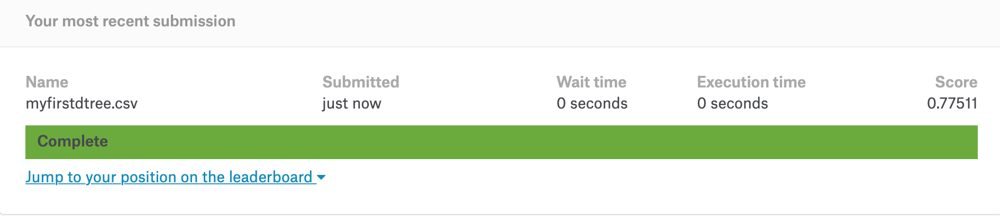

```{r setup, include=FALSE}
knitr::opts_chunk$set(echo = TRUE)
library(ggplot2)
```

## Titanic dataset і його аналіз

Завантажимо датасет

```{r}
train <- read.csv("Titanic/train.csv", stringsAsFactors = FALSE)
test <- read.csv("Titanic/test.csv", stringsAsFactors = FALSE)
```

```{r,echo=FALSE}
# Imputation of Age based on Pclass
impute.age <- function(age,class){
  vector <- age
  for (i in 1:length(age)){
    if (is.na(age[i])){
      if (class[i] == 1){
        vector[i] <- round(mean(filter(train,Pclass==1)$Age, na.rm=TRUE),0)
      }else if (class[i] == 2){
        vector[i] <- round(mean(filter(train,Pclass==2)$Age, na.rm=TRUE),0)
      }else{
        vector[i] <- round(mean(filter(train,Pclass==3)$Age, na.rm=TRUE),0)
      }
    }else{
      vector[i]<-age[i]
    }
  }
  return(vector)
}
```

## Дані, що вони показують

```{r}
str(train)
```

## Отже почнемо

Підключимо tidyverse

```{r}
library(tidyverse)
```

## Додамо відсутні дані з минулої лекції

```{r}
train$Fare[is.na(train$Fare)==TRUE] = median(filter(train, Pclass==3 & Embarked=="S")$Fare, na.rm=TRUE)
train$Embarked[train$Embarked==""] = "C"
imputed.age <- impute.age(train$Age,train$Pclass)
train$Age <- imputed.age
colSums(is.na(train)|train=='')
```

## Перше наближення і його точність

```{r}
test$Survived <- rep(0, 418)
submit <- data.frame(PassengerId = test$PassengerId, Survived = test$Survived)
write.csv(submit, file = "theyallperish.csv", row.names = FALSE)
```

## Перевіримо

```{r}

```

## Тепер спробуємо покращити результат

Dplyr + всі жінки врятувались

```{r}
library(dplyr)
female <- function(id)  ifelse(test[test$PassengerId == id,]$Sex == 'female',1,0)

submit <- submit %>%
  mutate(Survived = female(PassengerId)) 
  
```

## Нова спроба!

```{r}
write.csv(submit, file = "femalesSurvived.csv", row.names = FALSE)
```

```{r}

```

## Додамо дітей в модель, їх виживання теж вище

```{r}
train$Child <- 0
train$Child[train$Age < 18] <- 1
```

## Тепер проаналізуємо виживання

```{r}
train %>%
  group_by(Child,Sex) %>%
  summarise(survived_number = sum(as.numeric(Survived) - 1),
            total = n())

```

## Додамо відсоток

```{r}
train %>%
  group_by(Child,Sex) %>%
  summarise(survived_number = sum(as.numeric(Survived) - 1),
            total = n(),
            percent_survived = survived_number / total)


```

## Тепер додамо клас

```{r}
train %>%
  group_by(Child,Sex,Pclass) %>%
  summarise(survived_number = sum(as.numeric(Survived) - 1),
            total = n(),
            percent_survived = survived_number / total) %>%
  arrange(desc(percent_survived))

```

## Давайте побудуємо на цьому модель

```{r}
test$Survived <- 0
test$Child <- 0
test$Child[test$Age < 18] <- 1
test$Survived[test$Child == 1 & test$Pclass %in% c(1,2)] <- 1
test$Survived[test$Sex == 'female'] <- 1
submit$Survived <- test$Survived
write.csv(submit, file = "impovedSurvived.csv", row.names = FALSE)

```

## Результат

```{r}

```

## Тепер додамо вартість каюти

```{r}
train$Fare2 <- '30+'
train$Fare2[train$Fare < 30 & train$Fare >= 20] <- '20-30'
train$Fare2[train$Fare < 20 & train$Fare >= 10] <- '10-20'
train$Fare2[train$Fare < 10] <- '<10'

train %>%
  group_by(Child,Sex,Pclass,Fare2) %>%
  summarise(survived_number = sum(as.numeric(Survived) - 1),
            total = n(),
            percent_survived = survived_number / total) %>%
  arrange(desc(percent_survived))
```

## Про які фішки ми забули?

```{r,echo=FALSE}
train$FamilySize <- train$SibSp + train$Parch + 1
train$Title <- gsub("^.*, (.*?)\\..*$", "\\1", train$Name)
train$Title[train$Title == 'Mlle' | train$Title == 'Ms'] <- 'Miss' 
train$Title[train$Title == 'Mme']  <- 'Mrs' 
train$Title[train$Title %in% c('Capt', 'Don', 'Major', 'Sir', 'Jonkheer')] <- 'Sir'
train$Title[train$Title %in% c('Dona', 'Lady', 'the Countess')] <- 'Lady'
```

```{r}
train %>%
  group_by(FamilySize, Title,Pclass,Fare2) %>%
  summarise(percent_survived = sum(as.numeric(Survived) - 1) / n()) %>%
  arrange(desc(percent_survived))
```


## Ще одна штука

```{r}
colSums(is.na(test)|test=='')
```
Потрібно внести дані!

## Внесення пропущених даних

```{r}
imputed.age <- impute.age(test$Age,test$Pclass)
test$Age <- imputed.age
colSums(is.na(test)|test=='')
```

## Що з чеком

```{r}
test[is.na(test$Fare),]
test$Fare[is.na(test$Fare)==TRUE] = median(filter(test, Pclass==3 & Embarked=="S")$Fare, na.rm=TRUE)
```

## Занесемо наші результати для 

```{r}
test$Survived <- 0
test$Child[test$Age < 18] <- 1
test$Survived[test$Child == 1 & test$Pclass %in% c(1,2)] <- 1
test$Survived[test$Sex == 'female'] <- 1
test$Survived[test$Sex == 'female' & test$Pclass == 3 & test$Fare >= 20] <- 0
submit$Survived <- test$Survived
write.csv(submit, file = "impovedSurvived.csv", row.names = FALSE)
```


## Результат

```{r}

```

## Дерева рішень

```{r}
library(rpart)
fit <- rpart(Survived ~ Pclass + Sex + Age + SibSp + Parch + Fare + Embarked,
               data=train,
               method="class")
```

## Візуалізація

```{r}
plot(fit)
text(fit)
```
## Але є добрі люди

```{r}
library(rattle)
library(rpart.plot)
library(RColorBrewer)
```

## Тепер візуалізація буде краще

```{r}
fancyRpartPlot(fit)
```


## Як робити прогноз на основі дерева?

```{r}
Prediction <- predict(fit, test, type = "class")
submit <- data.frame(PassengerId = test$PassengerId, Survived = Prediction)
write.csv(submit, file = "myfirstdtree.csv", row.names = FALSE)
```


## Ще одна спроба

```{r}
fit <- rpart(Survived ~ Pclass + Sex + Age + Fare2 + Child + SibSp + Parch,
               data=train,
               method="class")
fancyRpartPlot(fit)
```

## Інженерія особливостей (Feature engineering)

Було б непогано виділити звернення? Можливо незаміжніх рятують краще за інших. А жінок рятують краще за чоловіків? 

```{r}
train$Title <- gsub("^.*, (.*?)\\..*$", "\\1", train$Name)
table(train$Sex, train$Title)
```
але їх тут дуже багато

## Зменшимо кількість

```{r}
train$Title[train$Title == 'Mlle' | train$Title == 'Ms'] <- 'Miss' 
train$Title[train$Title == 'Mme']  <- 'Mrs' 
train$Title[train$Title %in% c('Capt', 'Don', 'Major', 'Sir', 'Jonkheer')] <- 'Sir'
train$Title[train$Title %in% c('Dona', 'Lady', 'the Countess')] <- 'Lady'
table(train$Sex, train$Title)
```

## Розмір сім'ї

```{r}
FamilySize <- train$SibSp + train$Parch + 1

table(FamilySize)
```
Знов таки - багато категорій

## Три типи сім'ї

```{r}
train$FamilySize <- sapply(1:nrow(train), function(x) 
                          ifelse(FamilySize[x]==1, "Single", 
                          ifelse(FamilySize[x]>4, "Large", "Small")))

table(train$FamilySize)
```


## Аналіз даних

```{r}
train$Survived = factor(train$Survived)
train$Pclass = factor(train$Pclass)
train$Sex = factor(train$Sex)
train$Embarked = factor(train$Embarked)
train$Title = factor(train$Title)
train$FamilySize = factor(train$FamilySize, levels=c("Single","Small","Large"))

#Checking the structure of the data
str(train)
```


## Отже повне дерево

```{r}
fit <- rpart(Survived ~ Pclass + Sex + Age + Fare + Embarked + Child + SibSp + Parch,
               data=train,
               method="class")
fancyRpartPlot(fit)
```

## Додамо звернення до тесту

```{r}
test$Title <- gsub("^.*, (.*?)\\..*$", "\\1", test$Name)
test$Title[test$Title == 'Mlle' | test$Title == 'Ms'] <- 'Miss' 
test$Title[test$Title == 'Mme']  <- 'Mrs' 
test$Title[test$Title %in% c('Capt', 'Don', 'Major', 'Sir', 'Jonkheer')] <- 'Sir'
test$Title[test$Title %in% c('Dona', 'Lady', 'the Countess')] <- 'Lady'
table(train$Sex, train$Title)
table(test$Sex, test$Title)

```

## Будуємо дерево

```{r, eval=FALSE}
train$Pclass <- factor(train$Pclass)
test$Pclass <- factor(test$Pclass)
fit <- rpart(Survived ~ Pclass + Sex + Age + Fare + Title,
               data=train,
               method="class")
fancyRpartPlot(fit)
```
## Будуємо дерево

```{r, echo=FALSE}
train$Pclass <- factor(train$Pclass)
test$Pclass <- factor(test$Pclass)
fit <- rpart(Survived ~ Pclass + Sex + Age + Fare + Title,
               data=train,
               method="class")
fancyRpartPlot(fit)
```

## Є покращення для дерева, але гірше за нашу просту модель

```{r}
Prediction <- predict(fit, test, type = "class")
submit <- data.frame(PassengerId = test$PassengerId, Survived = Prediction)
write.csv(submit, file = "myfirstdtree.csv", row.names = FALSE)
```

## Результат

```{r}

```

## Об'єднаємо вибірки

```{r}
train$Fare2 <- NULL
train$FamilySize <- NULL
combi <- rbind(train, test)
```

## 

```{r}
combi$Title <- gsub("^.*, (.*?)\\..*$", "\\1", combi$Name)
combi$Title[combi$Title == 'Mlle' | combi$Title == 'Ms'] <- 'Miss' 
combi$Title[combi$Title == 'Mme']  <- 'Mrs' 
combi$Title[combi$Title %in% c('Capt', 'Don', 'Major', 'Sir', 'Jonkheer')] <- 'Sir'
combi$Title[combi$Title %in% c('Dona', 'Lady', 'the Countess')] <- 'Lady'
table(combi$Title)
```

##
```{r}
combi$FamilySize <- combi$SibSp + combi$Parch + 1
combi$Surname <- sapply(combi$Name, FUN=function(x) {strsplit(x, split='[,.]')[[1]][1]})
combi$FamilyID <- paste(as.character(combi$FamilySize), combi$Surname, sep="")
combi$FamilyID[combi$FamilySize <= 2] <- 'Small'
table(combi$FamilyID)
```

## Потрібно очистити некоректні прізвища

```{r}
famIDs <- data.frame(table(combi$FamilyID))
famIDs <- famIDs[famIDs$Freq <= 2,]
famIDs
```

## Видалимо маленькі сім

```{r}
combi$FamilyID[combi$FamilyID %in% famIDs$Var1] <- 'Small'
combi$FamilyID <- factor(combi$FamilyID)
```

## Розділимо датасети

```{r}
train <- combi[1:891,]
test <- combi[892:1309,]
```

## Дерево нове

```{r}

fit <- rpart(Survived ~ Pclass + Sex + Age + SibSp + Parch + Fare + Embarked + Title + FamilySize + FamilyID,
               data=train, 
               method="class")
fancyRpartPlot(fit)
```

## Є покращення для дерева, але гірше за нашу просту модель

```{r}
Prediction <- predict(fit, test, type = "class")
submit <- data.frame(PassengerId = test$PassengerId, Survived = Prediction)
write.csv(submit, file = "myfirstdtree.csv", row.names = FALSE)
```

## Так, ми покращили результат!

```{r}

```

## Випадкові ліси. Модифікуємо склад сім'ї

```{r}
combi$FamilyID2 <- combi$FamilyID
combi$FamilyID2 <- as.character(combi$FamilyID2)
combi$FamilyID2[combi$FamilySize <= 3] <- 'Small'
combi$FamilyID2 <- factor(combi$FamilyID2)

combi$Title <- factor(combi$Title)

combi$Fare2 <- '30+'
combi$Fare2[combi$Fare < 30 & combi$Fare >= 20] <- '20-30'
combi$Fare2[combi$Fare < 20 & combi$Fare >= 10] <- '10-20'
combi$Fare2[combi$Fare < 10] <- '<10'
combi$Fare2 <- factor(combi$Fare2)

```

## Додаємо ліси

```{r}
library(randomForest)
set.seed(415)
```

## Запустити просто

```{r}
train <- combi[1:891,]
test <- combi[892:1309,]
colSums(is.na(train)|train=='')
fit <- randomForest(as.factor(Survived) ~ Pclass + Sex + Age  + Fare2 +
                                            Embarked + Title + FamilySize + FamilyID2,
                      data=train, 
                      importance=TRUE, 
                      ntree=2000)
```

## Що там в середині

```{r}
varImpPlot(fit)
```

## Створюємо передбачення

```{r}
Prediction <- predict(fit, test)
submit <- data.frame(PassengerId = test$PassengerId, Survived = Prediction)
write.csv(submit, file = "firstforest.csv", row.names = FALSE)
```
##
```{r}
library(party)
set.seed(415)
fit <- cforest(as.factor(Survived) ~ Pclass + Sex + Age + SibSp + Parch + Fare2 +
                                       Embarked + Title + FamilySize + FamilyID,
                 data = train, 
                 controls=cforest_unbiased(ntree=2000, mtry=3))
```
##
```{r,eval=FALSE}
set.seed(415)
fit <- cforest(as.factor(Survived) ~ Pclass + Sex + Age + SibSp + Parch + Fare + Embarked + Title + FamilySize + FamilyID,
               data = train, controls=cforest_unbiased(ntree=2000, mtry=3)) 
# Now let's make a prediction and write a submission file
Prediction <- predict(fit, test, OOB=TRUE, type = "response")
submit <- data.frame(PassengerId = test$PassengerId, Survived = Prediction)
write.csv(submit, file = "ciforest.csv", row.names = FALSE)
```

